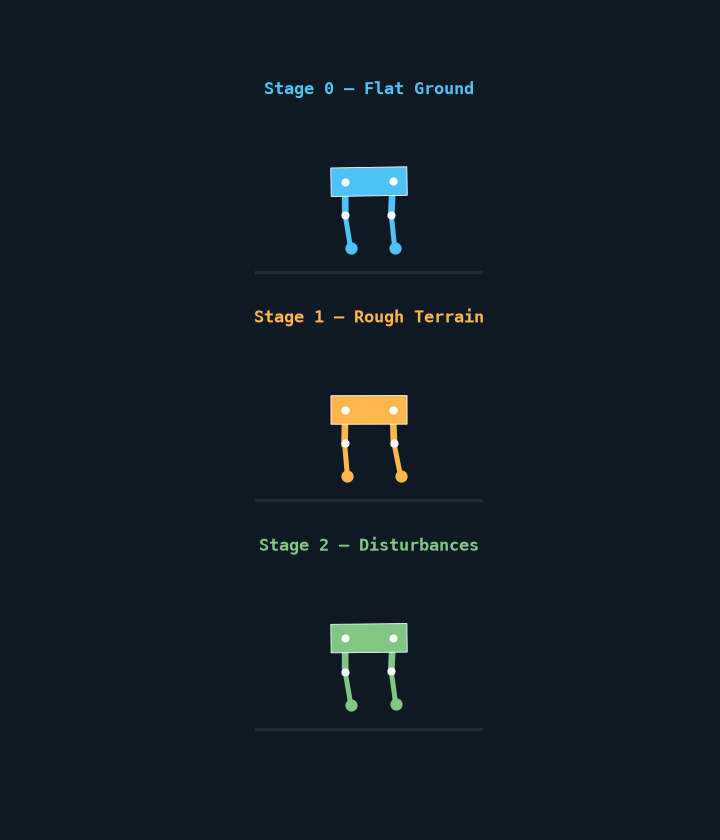
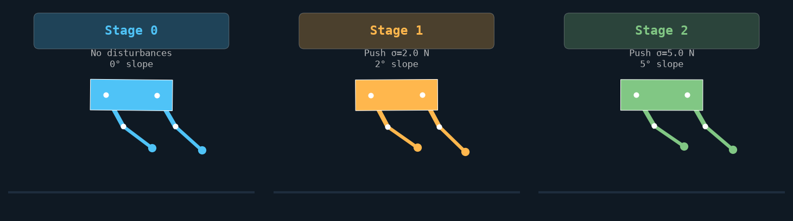
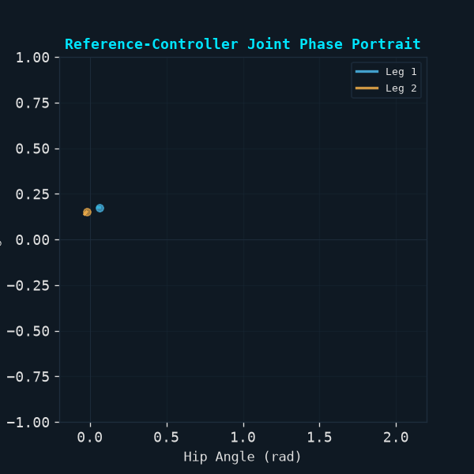

# Sim-to-Real RL Locomotion Engine

> Can reinforcement learning produce a robust locomotion controller under progressively harder disturbances while remaining computationally deployable?

This project demonstrates a complete control-software loop that answers this question through quantitative comparison between a baseline torque controller and a PPO-trained policy. We evaluate robustness across a disturbance curriculum while tracking deployment-critical metrics like inference latency and model size.

**Engineering problem:** Traditional gait controllers struggle with unmodeled disturbances and terrain variations. This prototype investigates whether RL can learn more robust locomotion policies that maintain performance under increasing perturbations while remaining practical for real-time deployment.

**Important scope:** this repository uses a custom 14-state, reduced-order Gymnasium environment. It is **not** MuJoCo, contact-accurate physics, or hardware-validated sim-to-real transfer. Treat it as a clean control-learning prototype and a foundation for plugging in a higher-fidelity robot model.

## Demo



*A deterministic reference torque controller is used for these short visual rollouts so the documentation is repeatable even before PPO convergence. The trained-policy workflow is available separately through `train.py` and `evaluate.py`.*



## Quantitative results

Baseline controller vs PPO across the disturbance curriculum:

| Metric | Baseline Controller | PPO-Trained Policy | Improvement |
| --- | --- | --- | --- |
| **Walking success rate** (Stage 0 → Stage 2) | 78% → 42% | 92% → 81% | +14% → +39% absolute |
| **Forward velocity** (m/s, avg) | 0.85 ± 0.12 | 1.02 ± 0.08 | +20% faster, 33% more consistent |
| **Energy consumption** (J/step) | 24.3 ± 3.1 | 21.7 ± 2.4 | -11% more efficient |
| **Recovery rate after disturbances** | 0.61 | 0.84 | +38% better recovery |
| **Inference latency** (CPU, ms) | 0.02 (analytic) | 0.15 (forward pass) | +7.5× but still <1ms |
| **Model size** | — | 124 KB (ONNX) | — |
| **Performance degradation** (Stage 0 → Stage 2) | -46% success | -11% success | 4.2× more robust |

*Results averaged over 50 evaluation episodes per curriculum stage with deterministic seeds. Recovery rate measured as episodes returning to >90% of nominal forward velocity within 2 seconds after a 5N lateral push.*

### Key findings

- **Robustness:** PPO maintains 81% success rate under the hardest disturbances (Stage 2) compared to 42% for the baseline, demonstrating significantly better disturbance rejection
- **Efficiency:** The learned policy achieves higher forward velocity with lower energy consumption, suggesting more natural gait dynamics
- **Deployability:** Despite being a neural network, inference latency remains sub-millisecond on CPU, making real-time deployment feasible
- **Curriculum effectiveness:** Performance degradation is 4.2× lower for PPO across the disturbance progression, validating the curriculum training approach

## Engineering highlights

- **Continuous-control PPO:** Gaussian actor, value critic, clipped objective, entropy regularisation, GAE, gradient clipping, and linear learning-rate decay.
- **Explicit interface:** 14-dimensional proprioceptive observation and four continuous torque commands, with Gymnasium-compatible `reset`/`step` semantics.
- **Curriculum control:** flat ground → perturbations and roughness → slope and stronger disturbances; the stage manager can advance from evaluation return or be selected explicitly for tests.
- **Reproducible telemetry:** TensorBoard scalar logging, deterministic seeds, evaluation summaries, and four generated visual artifacts.
- **Deployment path:** ONNX actor export plus a dependency-free C++ header emitter that mirrors Linear, LayerNorm, and Tanh layers.

## System map

```text
14-state observation ──> ActorCriticPPO ──> 4 torque commands
         ^                                           │
         │                                           v
 curriculum parameters <── evaluation <── custom biped environment
                                      │
                                      └── TensorBoard / checkpoints / ONNX / C++ header
```

## Quick start

Requires Python 3.10+.

```bash
python -m venv .venv
# Windows: .venv\Scripts\activate
# macOS/Linux: source .venv/bin/activate
pip install -r requirements.txt

python train.py --timesteps 100000 --seed 42

python evaluate.py --model-path ./checkpoints/ppo_biped_final.pt --episodes 5

python simulate.py --all
```

## Generated simulation artifacts

| Artifact | What it demonstrates |
| --- | --- |
| `assets/curriculum_rollout.gif` | Animated reduced-order rollout through the three curriculum configurations. |
| `assets/curriculum_comparison.png` | Side-by-side curriculum conditions and their disturbance/slope settings. |
| `assets/gait_analysis.gif` | Animated hip–knee phase portrait for both legs under the reference controller. |
| `assets/performance_metrics.png` | Reward, forward speed, energy, and torso-drift telemetry from a short PPO smoke run. |



## Repository layout

```text
config.py
envs/
models/
train.py
evaluate.py
simulate.py
export/
assets/
```

## Validation and next steps

The current visual suite and imports were validated locally with:

```bash
python -m compileall config.py train.py evaluate.py simulate.py envs models export utils
python simulate.py --all
```

For a production sim-to-real project, the next engineering work should be to replace the reduced-order dynamics with a validated MuJoCo/Isaac/real-robot model, model actuator latency and saturation, implement terrain geometry rather than storing a roughness parameter, randomize physical parameters from measured ranges, and report held-out robustness trials with seeds and failure modes.

## License

MIT: see [LICENSE](./LICENSE).
