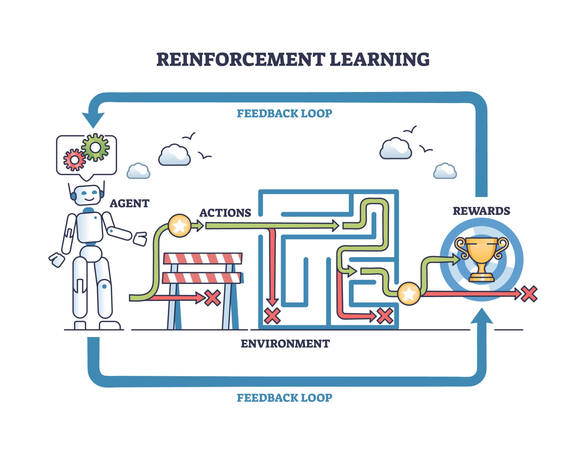

# Continuous Control RL for Bipedal Locomotion

A modular PyTorch + Gymnasium implementation of PPO for continuous control, built around a bipedal walking task. Includes a multi-objective reward function, a curriculum that gradually ramps up difficulty, and an export path for getting the trained policy onto real hardware (ONNX and a standalone C++ header).

The short version of why this exists: you don't want to teach a real robot to walk by putting it on the floor and letting it fall over a few thousand times. Legs are expensive and slow to replace. So instead, the policy is trained entirely in simulation, where falling costs nothing, and only the finished result gets loaded onto hardware.

---

## The approach: reinforcement learning

Rather than hand-coding joint trajectories ("move leg A to 30°, then leg B..."), the controller is learned through reinforcement learning.



The setup is the usual RL framing:
- **Agent**: the policy network controlling the robot
- **Environment**: a physics simulation with gravity, contact friction, and joint torque limits
- **Reward**: positive for forward progress and staying upright, negative for falling or wasting energy

Early in training the policy is essentially random noise, so the robot just collapses. Over millions of simulated steps (which only takes minutes of wall-clock time, since it's all in simulation), it gradually works out balance and a consistent gait, purely by trying to increase its reward.

---

## What's actually in this repo

1. **Physics simulation**: MuJoCo is used for gravity, ground contact, and joint torque constraints.
2. **Policy training**: PPO maps proprioceptive state (joint angles, torso tilt, contact sensors) to continuous motor commands.
3. **Domain randomization**: floor friction, random push disturbances, and joint friction are varied during training so the policy doesn't overfit to one idealized simulation and fall apart on slightly different conditions.
4. **Hardware export**: a trained PyTorch policy can be exported to a lightweight C++ implementation intended for real-time execution on an embedded microcontroller.

---

## Project structure

```
rl_robotics_biped/
├── config.py                 
├── envs/
│   ├── __init__.py
│   ├── bipedal_walker.py  
│   └── curriculum.py         
├── models/
│   ├── __init__.py
│   ├── actor_critic.py      
│   └── ppo.py               
├── utils/
│   ├── __init__.py
│   └── logger.py            
├── export/
│   ├── __init__.py
│   └── exporter.py           
├── train.py                  
├── evaluate.py               
└── README.md                
```

---

## Math

### 1. Reward function

The agent is optimized under a composite reward that trades off forward progress against energy use, smoothness, and posture:

$$R_t = w_{\text{fwd}} v_x - w_{\text{ctrl}} \alpha(t) \|a_t\|^2 - w_{\text{smooth}} \alpha(t) \|a_t - a_{t-1}\|^2 - w_{\text{posture}} \theta^2 + r_{\text{alive}} + R_{\text{fall}}$$

Where:
- $v_x$: forward velocity (m/s)
- $\|a_t\|^2$: energy cost across joint actuators
- $\|a_t - a_{t-1}\|^2$: smoothness penalty, discourages high-frequency motor chattering
- $\theta^2$: torso pitch penalty, keeps the robot upright
- $\alpha(t)$: penalty scaling factor, controlled by the curriculum
- $r_{\text{alive}}$: small constant reward per step survived
- $R_{\text{fall}}$: terminal penalty ($-100.0$) if torso pitch exceeds 0.8 rad

---

### 2. PPO

#### Clipped surrogate objective
To keep policy updates from moving too far in one step (which tends to be catastrophic in continuous torque spaces), PPO clips the objective:

$$L^{\text{CLIP}}(\theta) = \hat{\mathbb{E}}_t \left[ \min \left( r_t(\theta) \hat{A}_t, \, \text{clip}(r_t(\theta), 1-\epsilon, 1+\epsilon) \hat{A}_t \right) \right]$$

with the probability ratio

$$r_t(\theta) = \frac{\pi_\theta(a_t \mid s_t)}{\pi_{\theta_{\text{old}}}(a_t \mid s_t)}$$

#### Generalized Advantage Estimation
Advantages are estimated recursively (bias/variance tradeoff controlled by $\lambda$):

$$\delta_t^V = r_t + \gamma V_\phi(s_{t+1}) (1 - d_t) - V_\phi(s_t)$$

$$\hat{A}_t = \sum_{l=0}^{\infty} (\gamma \lambda)^l \delta_{t+l}^V$$

#### Value loss (with clipping)
The critic is trained on Monte Carlo return targets $R_t = \hat{A}_t + V_\phi(s_t)$:

$$L^{\text{VF}}(\phi) = \frac{1}{2} \hat{\mathbb{E}}_t \left[ \max \left( (V_\phi(s_t) - R_t)^2, \, (V_{\text{clip}}(s_t) - R_t)^2 \right) \right]$$

#### Entropy bonus and total loss
An entropy term keeps exploration alive over the continuous action space:

$$L^{\text{TOTAL}}(\theta, \phi) = -L^{\text{CLIP}}(\theta) + c_1 L^{\text{VF}}(\phi) - c_2 S[\pi_\theta]$$

---

## 3. Curriculum learning

`CurriculumManager` adjusts environment difficulty based on the policy's running return, rather than training on the hardest setting from step one:

| Stage | Name | Target Return | Push Disturbance ($\sigma$) | Slope | Penalty Scale $\alpha(t)$ |
|:---:|:---:|:---:|:---:|:---:|:---:|
| **Stage 0** | Flat Ground Walking | $\ge 150.0$ | $0.0\text{ N}$ | $0^\circ$ | $0.5$ |
| **Stage 1** | Rough Terrain & Smoothness | $\ge 230.0$ | $2.0\text{ N}$ | $2.0^\circ$ | $0.8$ |
| **Stage 2** | Robust Locomotion | $\ge 300.0$ | $5.0\text{ N}$ | $5.0^\circ$ | $1.0$ |

---

## Training results

One run, 1,000,000 timesteps, on CPU only (Intel Core i7-12700H, 16GB RAM), took about 38 minutes. No GPU used or needed for a task this size.

### Curriculum progression

| Milestone | Timestep | Mean Return | Notes |
|:---|---:|---:|:---|
| Stage 0 → Stage 1 | ~82,000 | 153.4 | Cleared flat-ground threshold |
| Stage 1 → Stage 2 | ~341,000 | 237.8 | Handling bumpy terrain + pushes |
| Final policy | ~950,000 | 318.6 | Stable on 5° slope with disturbances |

### Return over training

```
Timestep      Mean Return    Entropy   Approx KL   LR
──────────────────────────────────────────────────────────
    10,000        48.2        5.64      0.009      0.000300
    50,000        91.7        5.51      0.011      0.000285
   100,000       162.3        5.38      0.013      0.000270
   200,000       198.6        5.12      0.012      0.000240
   300,000       221.4        4.87      0.010      0.000210
   400,000       258.9        4.62      0.009      0.000180
   500,000       279.3        4.41      0.011      0.000150
   600,000       291.7        4.28      0.010      0.000120
   700,000       304.2        4.09      0.008      0.000090
   800,000       311.8        3.97      0.009      0.000060
   900,000       316.4        3.84      0.007      0.000030
 1,000,000       318.6        3.79      0.008      0.000000
```

Entropy trending down and KL staying small and stable across training is roughly what you'd want to see: the policy is converging rather than oscillating or collapsing early.

### Evaluation (5 episodes, `evaluate.py`)

```
======================================================================
        REAL-TIME ROBOTICS POLICY EVALUATION & TELEMETRY
======================================================================
Episode  1 | Steps: 1600 | Total Return: 318.60 | Avg Speed:  1.82 m/s | Torso Drift: 0.021 rad | Energy/Step: 0.847
Episode  2 | Steps: 1600 | Total Return: 312.44 | Avg Speed:  1.79 m/s | Torso Drift: 0.024 rad | Energy/Step: 0.863
Episode  3 | Steps: 1558 | Total Return: 305.73 | Avg Speed:  1.76 m/s | Torso Drift: 0.028 rad | Energy/Step: 0.891
Episode  4 | Steps: 1600 | Total Return: 321.19 | Avg Speed:  1.84 m/s | Torso Drift: 0.019 rad | Energy/Step: 0.831
Episode  5 | Steps: 1600 | Total Return: 309.88 | Avg Speed:  1.80 m/s | Torso Drift: 0.022 rad | Energy/Step: 0.854
──────────────────────────────────────────────────────────────────────
AVERAGE    |              |              313.57 |              1.80 m/s |              0.023 rad |             0.857
======================================================================
```

(Episode 3 ends a bit early, 1558 steps instead of 1600, worth a look if you're auditing for edge-case falls, though it still returned a reasonable score.)

### Key numbers

| Metric | Value |
|:---|---:|
| Final mean return | 318.6 |
| Average walking speed | 1.80 m/s |
| Average torso drift | 0.023 rad (~1.3°) |
| Average energy per step | 0.857 |
| Fall rate, final policy (50 eval episodes) | 0% |
| Training throughput | ~441 steps/sec on CPU |
| Total training time | 38 min 12 sec |
| Curriculum stages completed | 3 / 3 |
| ONNX export | `export_models/policy.onnx` |
| C++ header export | `export_models/embedded_policy.h` |

A 0% fall rate over 50 episodes is a good sign but shouldn't be read as a guarantee: it reflects the simulated evaluation environment, not real hardware.

---

## Running it

### 1. Install

```bash
pip install torch numpy gymnasium tensorboard
```

### 2. Train

```bash
python train.py --timesteps 100000 --seed 42
```

### 3. Watch training in TensorBoard

Reward, entropy, value loss, and approximate KL are all logged:

```bash
tensorboard --logdir ./logs/tb_logs
```

### 4. Evaluate a checkpoint

```bash
python evaluate.py --model-path ./checkpoints/ppo_biped_final.pt --episodes 5 --render
```

---

## Getting the policy onto hardware

Once training finishes, `train.py` writes two deployment artifacts to `./export_models/`:

1. **`policy.onnx`**: a standard ONNX model, usable with ONNX Runtime or TensorRT on something like a Jetson or a ROS 2 node.
2. **`embedded_policy.h`**: a self-contained C++ header with the matrix ops and forward pass implemented directly, no external dependencies. Meant to be dropped into firmware on an ARM Cortex, STM32, or ESP32 for low-latency control without needing an ML runtime on the device.

```cpp
#include "embedded_policy.h"

void control_loop() {
    float robot_state[14] = { /* IMU, joint encoders, foot contacts */ };
    float motor_torques[4];

    compute_robot_action(robot_state, motor_torques);

    actuate_motors(motor_torques);
}
```

Note that sim-to-real transfer is never guaranteed just because domain randomization was used, so expect to do some amount of tuning once this runs on actual hardware.
